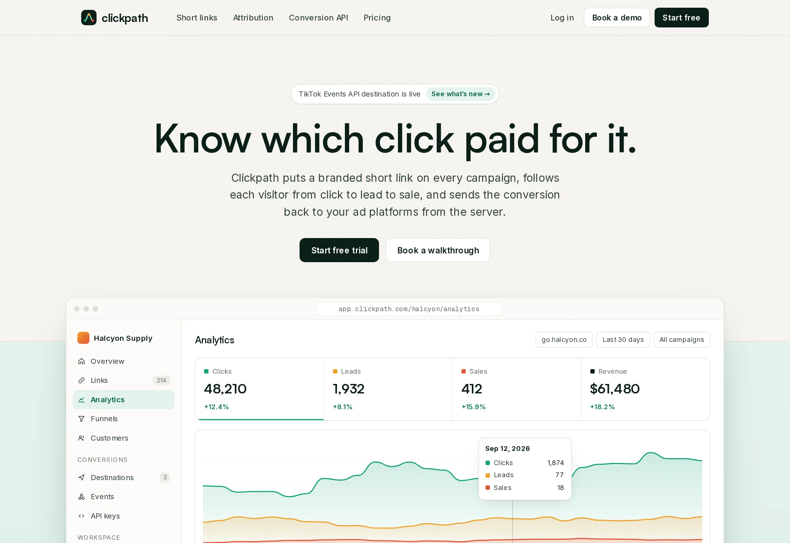

# Clickpath

Link and conversion attribution: branded short links, UTM builder, click-to-sale funnels and a server-side conversion API.

**Live demo:** https://www.freelancerportfoliohub.com/jameslee/projects/clickpath/index.html



## Overview

Clickpath traces every dollar of ad spend from the first click on a branded link to the sale it produced, and reports
that sale back to the ad platforms that bought the click. This repository contains the marketing site, the product UI
shown on it (analytics dashboard, funnel, UTM builder, conversion event log) and the API routes behind the builder
and the Conversion API.

## Features

- **UTM builder** (`components/links/UtmBuilder.tsx`): naming templates with allowed sources and mediums, campaign
  patterns such as `{season}_{product}_{year}`, live final-URL preview, value normalisation, a branded QR code of the
  short link and link options. Creating a link posts to `/api/links`.
- **Analytics components**: KPI strip with a hoverable click/lead/sale timeline, funnel band, breakdown bars, link
  performance table and customer journey timeline. All charts are hand-drawn SVG.
- **Attribution models** (`lib/attribution.ts`): first click, last click, linear and time decay with lookback and
  half-life options, plus per-source credit and side-by-side model comparison.
- **Conversion API** (`POST /api/conversions`): zod-validated leads and sales, idempotent on `eventId`, SHA-256
  hashing of emails and phone numbers, consent handling, last-click attribution to the originating link and per-platform
  payloads for Meta CAPI, Google Ads, TikTok Events API and webhooks.
- **Links API** (`GET/POST /api/links`): slug and destination validation, required-template enforcement and
  per-domain slug conflicts.
- **Attribution report** (`GET /api/reports/attribution?model=`): credited revenue by source for any model.

## Tech stack

- [Next.js 15](https://nextjs.org/) App Router, React 19, TypeScript (strict)
- [zod](https://zod.dev/) for request validation
- [qrcode](https://github.com/soldair/node-qrcode) for QR matrices (rendered as SVG)
- Plain CSS design system in `app/globals.css`; Satoshi, Inter and Geist Mono self-hosted from `public/fonts`

## Getting started

```bash
pnpm install
cp .env.example .env.local
pnpm dev
```

### Environment variables

| Variable                                               | Description                                                    |
| ------------------------------------------------------ | -------------------------------------------------------------- |
| `CLICKPATH_SECRET_KEY`                                 | Bearer key required by `POST /api/conversions`                 |
| `META_PIXEL_ID`, `META_CAPI_ACCESS_TOKEN`              | Enables the Meta Conversions API destination                   |
| `GOOGLE_ADS_CUSTOMER_ID`, `GOOGLE_ADS_DEVELOPER_TOKEN` | Enables the Google Ads destination                             |
| `TIKTOK_PIXEL_CODE`, `TIKTOK_EVENTS_ACCESS_TOKEN`      | Enables the TikTok Events API destination                      |
| `CONVERSION_WEBHOOK_URL`                               | Forwards every conversion to your own endpoint                 |

### Tracking a sale

```bash
curl -X POST http://localhost:3000/api/conversions \
  -H "Authorization: Bearer $CLICKPATH_SECRET_KEY" \
  -H "Content-Type: application/json" \
  -d '{
    "type": "sale",
    "clickId": "clk_Q3xR9a",
    "eventId": "order_10482",
    "amount": 14800,
    "currency": "usd",
    "customer": { "externalId": "cus_10482", "email": "sam@example.com" }
  }'
```

Sending the same `eventId` again returns `"duplicate": true` and nothing is forwarded twice.

## Project structure

```
app/
  page.tsx, links/, attribution/, conversions/, pricing/   marketing pages
  api/links, api/conversions, api/reports/attribution      route handlers
  globals.css
components/
  analytics/     dashboard, PerformanceChart, AreaChart, FunnelChart, BarList, CustomerTimeline…
  links/         UtmBuilder, QrCode, LinkStack, DomainTable, RoutingRules, UtmTemplateTable
  conversions/   EventStream, EventFlow, DeliveryLog, CodeSample
  marketing/     section building blocks
  pricing/       PlanCard, ComparisonTable
  site/, ui/     header, footer, icons and primitives
lib/
  attribution.ts   attribution models
  utm.ts           UTM building, normalisation and template validation
  links.ts         link schema and repository
  conversions.ts   conversion schema, dedupe, hashing, destination payloads
  data/            typed content and demo workspace data
types/             links, analytics and conversion types
public/            fonts, images, favicon
```

## Scripts

| Script           | Description                      |
| ---------------- | -------------------------------- |
| `pnpm dev`       | Start the dev server (Turbopack) |
| `pnpm build`     | Production build                 |
| `pnpm start`     | Serve the production build       |
| `pnpm lint`      | ESLint                           |
| `pnpm typecheck` | TypeScript, no emit              |
| `pnpm format`    | Prettier                         |
